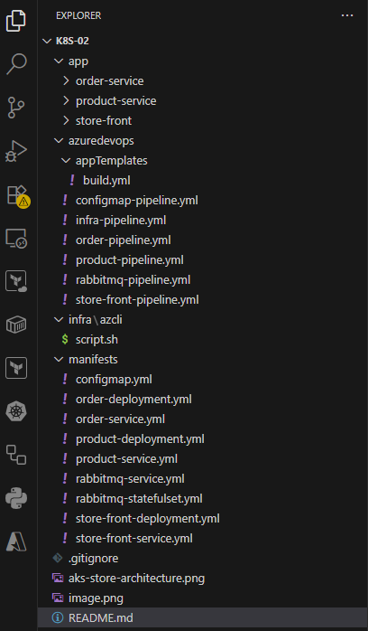

# Deploying microservice applications in AKS using Azure DevOps

    A sample multi-container application with a group of microservices and web front ends 
    that simulate a retail scenario.

    Part1 (Manual Deployment using comand line tools):
    AzCLI, Docker Desktop and kubectl: https://github.com/santosh-gh/k8s-01

    YouTube: https://youtu.be/zoJ7MMPVqFY

# Architesture

    # Store front: Web application for customers to view products and place orders.
    # Product service: Shows product information.
    # Order service: Places orders.
    # RabbitMQ: Message queue for an order queue.

# Directory Structure

 

# YouTube: 

    https://youtu.be/zoJ7MMPVqFY    
 
# GitHub Repository (source code)

    https://github.com/santosh-gh/k8s-02

# Steps

    1. Set up Azure DevOps
    2. Infra deployment: Azure Pipeline (AzureCLI@2)
    3. Build and push images to ACR: Azure Build and Push Pipeline (docker@2)
    4. App deployment: Azure Release (AzureCLI@2)
    5. Validate and Access the application
    6. Clean the Azure resources

# Set up Azure DevOps

    Create Organization, Project and Permissions

    Create Service Principal (app reg) for Azure DevOps to authenticate with Azure

    Create DevOps Service Connection to Azure (ARM) for Infrastructure Pipelines

# Setup and run Infra Pipeline

    infra-pipeline.yml

    Connect to cluster

        az login
        az account set --subscription=<subscriptionId>
        az account show

        RESOURCE_GROUP="rg-onlinestore-dev-uksouth-001"
        AKS_NAME="aks-onlinestore-dev-uksouth-001"

        az aks get-credentials --resource-group $RESOURCE_GROUP --name $AKS_NAME

    Short name for kubectl

        alias k=kubectl

    Show all existing objects

        k get all

# Build and push images to ACR

    Create Azure ACR service connection
    Build and push images to ACR: Azure Pipeline (Docker@2)

    order-pipeline.yml
    product-pipeline.yml
    store-front-pipeline.yml

# Azure Release Pipeline

    Configure and run the Order Build and deployment Pipeline

        order-pipeline.yaml

    Configure and run the Product Build and deployment Pipeline

        product-pipeline.yaml

    Configure and run the store front Build and deployment Pipeline
    
        store-front-pipeline.yaml

    Configure and run the rabbitmq deployment Pipeline

        rabbitmq-pipeline.yaml

    Configure and run the configmap deployment Pipeline

        configmap-pipeline.yaml

# Write Kubernetes YAML Manifests for the applicatons

    configmap.yml
    order-deployment.yml
    order-service.yml
    product-deployment.yml
    product-service.yml
    store-front-deployment.yml
    store-front-service.yml
    rabbitmq-deployment.yml
    rabbitmq-service.yml

# Verify the Deployment

    k get pods
    k get services
    curl <LoadBalancer public IP>:80
    Browse the app using http://<LoadBalancer public IP>:80

# Clean the Azure resources

    az group delete --name rg-onlinestore-dev-uksouth-001 --yes --no-wait 